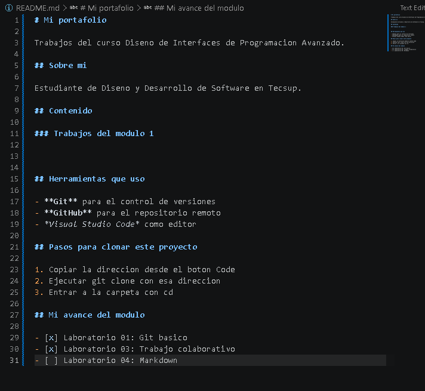

# Guia del Laboratorio 03

## Descripcion del proyecto

Este proyecto corresponde al Laboratorio 03 del curso de Diseño de Interfaces de Programacion Avanzado. El trabajo consistio en revisar un repositorio, encontrar errores y proponer correcciones mediante Pull Request.

### Herramientas utilizadas

- Git
- GitHub
- Visual Studio Code
- HTML
- CSS
- JavaScript

## Pasos para trabajar con el proyecto

1. Clonar el repositorio.
2. Entrar a la carpeta del proyecto.
3. Crear una rama para realizar los cambios.
4. Modificar los archivos necesarios.
5. Hacer commit y push.
6. Crear el Pull Request en GitHub.

## Avance del proyecto

- [x] Repositorio clonado
- [x] Errores corregidos
- [x] Pull Request realizado

## Archivos principales

| Archivo | Funcion |
|---------|---------|
| index.html | Contiene la estructura de la pagina |
| estilos.css | Contiene los estilos del proyecto |
| script.js | Contiene la logica del carrito |

## Comandos utilizados

Para revisar los cambios utilice `git status`.

```bash
git add .
git commit -m "Corrige errores del proyecto"
git push origin nombre-rama
```

## Enlace externo

- [GitHub](https://github.com/)

## Captura del proyecto



## Resultado

La guia permite entender de forma sencilla como se trabajo el proyecto y los principales comandos utilizados.